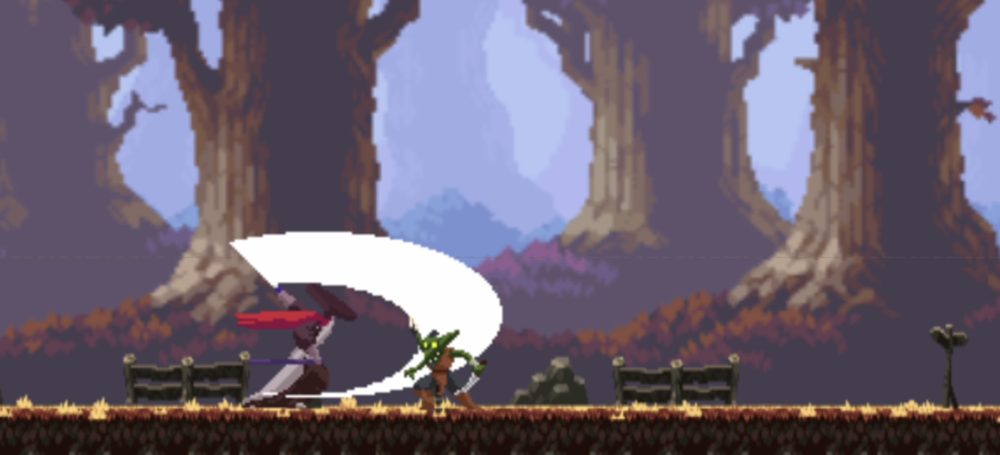

# Phaser 3 + React App




- [Phaser 3](https://github.com/photonstorm/phaser) - overlaid canvas with the config in `src/PhaserGame.ts` and a scene in `src/scenes/`
- React, TSX
- `src/App.tsx` showing how to communicate with Phaser within a React component
- That's it!

## Requirements

- pnpm (>=8.6) is **required**!

## Install & Start

```bash
pnpm i --frozen-lockfile # do not modify lockfile.
pnpm start
```
